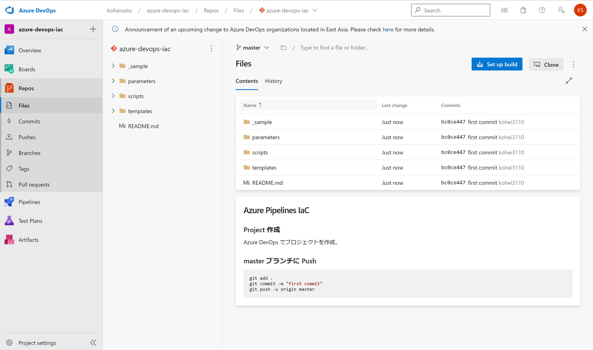
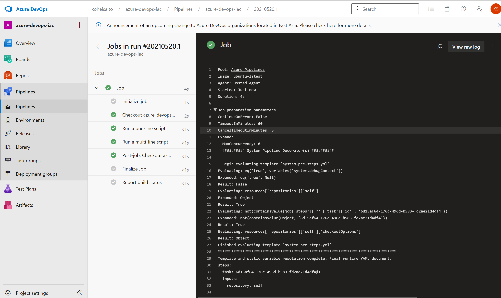

# Azure Pipelines IaC

## Project 作成
Azure DevOps でプロジェクトを作成。

## master ブランチに Push

```Powershell
git add .
git commit -m "first commit"
git push -u origin master
```



## Pipeline の設定
[Set up build] > [Starter pipeline] > [Save and run] を選択し、Pipeline を実行する。



## リソースの作成
ARM Template を活用して、リソースを作成する。

```
trigger:
- azure-pipelines

pool:
  vmImage: ubuntu-latest

steps:    
- task: AzureResourceManagerTemplateDeployment@3
  inputs:
    deploymentScope: 'Resource Group'
    azureResourceManagerConnection: 'Azure Internal Access Program WW Inside Sales_Subscription Cont(f0efe35e-b5a6-42ef-9a7a-e11fa99a1f8f)'
    subscriptionId: 'f0efe35e-b5a6-42ef-9a7a-e11fa99a1f8f'
    action: 'Create Or Update Resource Group'
    resourceGroupName: 'koheisaitolearn'
    location: 'West US'
    templateLocation: 'Linked artifact'
    csmFile: 'templates/azuredeploy.json'
    csmParametersFile: 'parameters/azuredeploy.json'
    deploymentMode: 'Incremental' 
```

## テスト実行
設定値が正しいか確認するため、Pester を活用してテストを実行する。